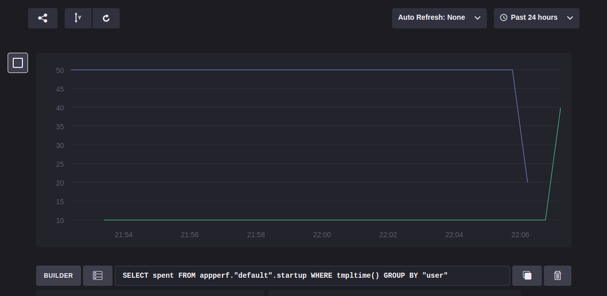

# simple-data-report

## why

随着业务增加,app可能在某些关键点遇到性能问题．所以需要一种手段对这些关键但进行监控,这样可以发现性能问题并且改进它. 简单点就是给函数打点，然后数据展示.

## what

- 数据存储:[InfluxDB](https://docs.influxdata.com)
- 数据采集:[influxdb-python](http://influxdb-python.readthedocs.io/)
- 数据展示:[chronograf](https://influxdata.com/time-series-platform/chronograf/)

## how

#####1. 安装InfluxDB:
https://docs.influxdata.com/influxdb/v0.13/introduction/installation/

安装完后可以打开:[http://127.0.0.1:8083/](http://127.0.0.1:8083/)进行创建数据库等操作. 如果后续的api访问需要加权限的话,可以先创建用户,然后修改配置``` /etc/influxdb/influxdb.conf```中```auth-enabled```字段为```true```.

#####2. 数据上报
> 下面展示一个实现启动耗时的上报,其中```appperf```是数据库,```startup```是启动耗时表.

```python
# -*- encoding:utf-8 -*-
"""
简单的数据上报例子,这部分可以封装成一个python包,方便像django之类的web框架集成
"""
import datetime
import sys
import logging
from influxdb import InfluxDBClient

logging.basicConfig()
client = InfluxDBClient('localhost', 8086, '账号', '密码')

json_body = [
    {
        "measurement": "startup",
        "tags": {
            "user": "1000"
        },
        "time": datetime.datetime.utcnow(),
        "fields": {
            "spent": 50.0
        }
    },
    {
        "measurement": "startup",
        "tags": {
            "user": "1001"
        },
        "time": datetime.datetime.utcnow() + datetime.timedelta(minutes=1),
        "fields": {
            "spent": 10.0
        }
    }
]


def is_db_exists(db_name):
    """
    查看数据库是否存在
    :param db_name:
    :return:
    """
    for db_item in client.get_list_database():
        if db_item['name'] == db_name:
            return True
    return False


def create_db(db_name):
    """
    创建数据库
    :param db_name:
    :return:
    """
    return client.create_database(db_name)


def main():
    db_name = "appperf"
    if not is_db_exists(db_name):
        logging.warning("{0} not exists, will create".format(db_name))
        create_db(db_name)

    client.write_points(json_body, database=db_name)


if __name__ == "__main__":
    sys.exit(main())
```

#####3. 数据展示

- 安装chronograf:[installation](https://docs.influxdata.com/chronograf/v0.13/introduction/installation/)
- 添加并展示，具体使用细节可以看文档,效果图如图:两条线分别是两个user三次上报的数据.


## 参考
- [influxdb授权](https://docs.influxdata.com/influxdb/v0.13/administration/authentication_and_authorization/#main-nav)
- [influxdb-handbook](https://www.gitbook.com/book/xtutu/influxdb-handbook/details)
- [influxdb授权保存策略](http://www.linuxdaxue.com/retention-policies-in-influxdb.html)
